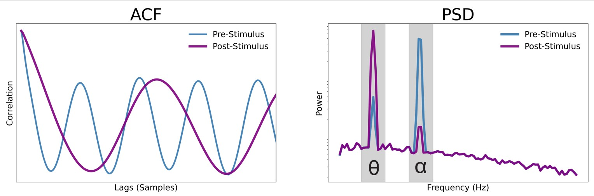

# Publications

## 2025

    

        
    

    

        <h3 class="publication-title">
            <a href="https://pmc.ncbi.nlm.nih.gov/articles/PMC12132356/" class="publication-link">
                Aperiodic neural timescales in prefrontal cortex dilate with increased task abstraction
            </a>
        </h3>
        
bioRxiv preprint

        
Dillan Cellier, Justin Riddle, Ryan Hammonds, Flavio Frohlich, Bradley Voytek 

        
2025

        
 Neural timescales can be thought of as the 'memory' of brain activity. The slower the timescales, the longer that the neural activity is staying self-similar. Faster timescales, on the other hand, may indicate that information is entering and disappearing from a neural circuit rapidly. Here, we tested whether electroencephalography (EEG) signals reflect slower or faster neural timescales when humans are performing a task. We found that in more complicated tasks, neural timescales (as measured from EEG) slow down more. Additionally, oscillatory activity shifts from being dominated by faster alpha-band (8-12 Hz) rhythms to slower theta-band (4-8 Hz) signals. 

        

            <a href="https://pmc.ncbi.nlm.nih.gov/articles/PMC12132356/" class="tag tag-arxiv">BIORXIV</a>
            <a href="https://voyteklab.com/timescale-methods/" class="tag tag-github">GITHUB</a>
        

    

<!-- 

    

        
    

    

        <h3 class="publication-title">
            <a href="https://arxiv.org/pdf/2510.19875" class="publication-link">
                Stream: Scaling Mechanistic Interpretability to Long Context in LLMs via Sparse Attention
            </a>
        </h3>
        
NeurIPS 2025 Mech Interp Workshop

        
J Rosser, José Luis Redondo García, Gustavo Penha, Konstantina Palla, Hugues Bouchard

        
2025

        

            Mechanistic Interpretability
            <a href="https://arxiv.org/pdf/2510.19875" class="tag tag-arxiv">ARXIV</a>
        

    

 -->

